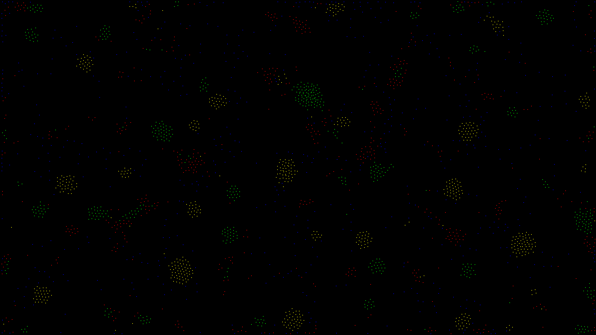

# Particle System
In dieser Simulation werden aus einzelnen Partikeln große Systeme, die komplex miteinander interagieren,
also nur schwer vorhergesagt werden können v.a. mit einer wachsenden Anzahl an Farben.
Um benachbarte Partikel effizient abzufragen, kommt ein Quadtree zum Einsatz.

Zum Verändern der Parameter kann man die Werte in der `attractionMatrix` anpassen. Dazu einfach die passende Variable in der `main` Funktion bearbeiten.

## Getting Started
- build: `make -j4 config=release`
- run: `bin/release/particleSystem`

## TODO

- multi threading
