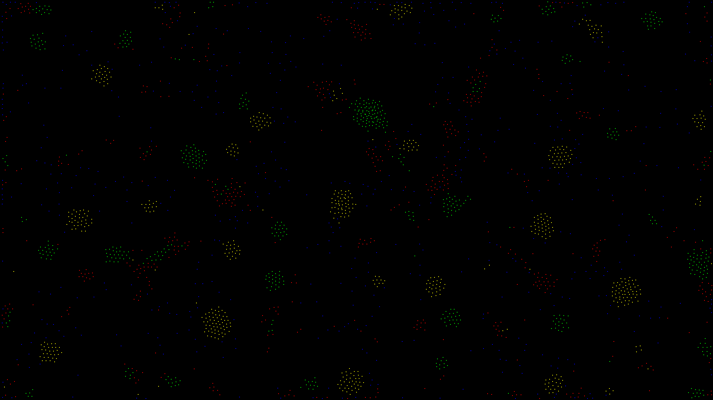

# Particle System
In dieser Simulation werden aus einzelnen Partikeln chaotische Systeme,
die also nur schwer vorhergesagt werden können.
Um benachbarte Partikel effizient abzufragen, kommt ein Quadtree zum Einsatz.

Zum Verändern der Parameter kann man die Werte in der `attractionMatrix` anpassen. Dazu einfach die passende Variable in der `main` Funktion bearbeiten.

## Getting Started
- build: `make -j4 config=release`
- run: `bin/release/particleSystem`

## TODO

- multi threading
